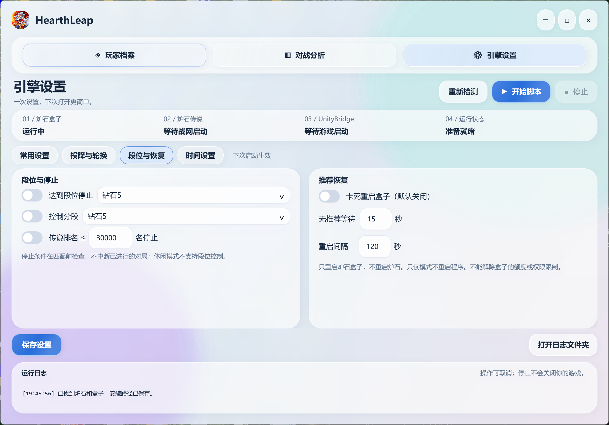
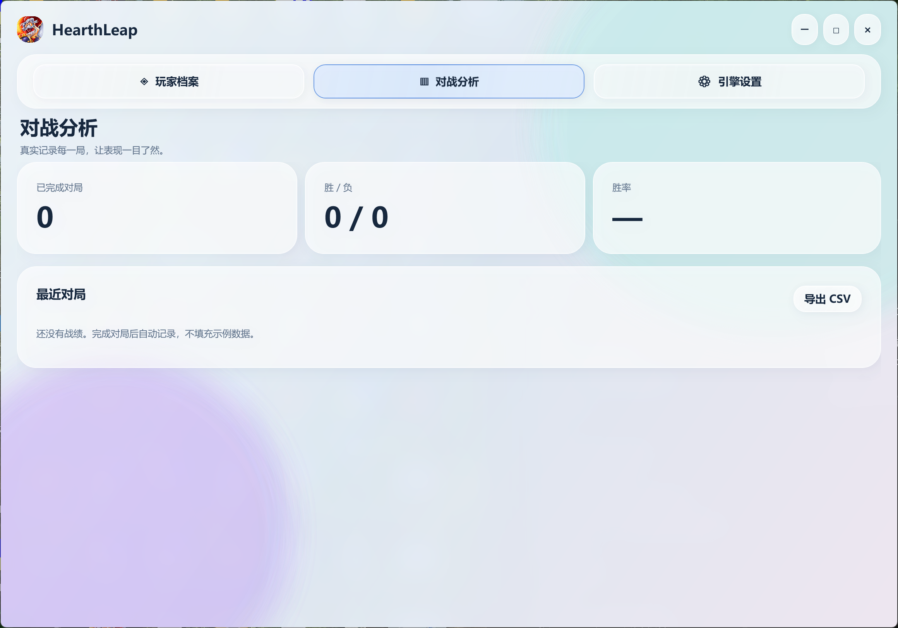

# 🏆 HearthLeap（梯悦）

**版本 / Version：0.1.8** · **Windows 桌面应用 / Windows desktop application** · **中文 / English**

> “梯悦”寓意“天梯上传说很快乐”。HearthLeap 是一个全新的独立软件项目，与此前的旧程序、旧版本和旧发布包没有关系。
>
> “梯悦” means enjoying the climb toward Legend. HearthLeap is a new and independent software project. It is not related to any previous program, legacy version, or old package.

## 🙏 致谢 / Acknowledgements

HearthLeap 的界面设计、功能规划和技术思路参考了以下公开项目，感谢原作者与贡献者的分享：

- [HearthstoneLegendArriver](https://github.com/magicstrangelzb/HearthstoneLegendArriver)
- [AutoHS — FallAbyss](https://github.com/FallAbyss/AutoHS)
- [AutoHS — Yiyuan-Dong](https://github.com/Yiyuan-Dong/AutoHS)

HearthLeap 是独立实现，不隶属于上述项目，也不代表上述项目作者。除明确标注的第三方组件外，本仓库不声称与这些项目存在代码继承关系。

HearthLeap is independently implemented and is not affiliated with or endorsed by the projects above. Unless explicitly stated otherwise, this repository does not claim code inheritance from those projects.

## 📖 软件介绍 / Introduction

HearthLeap（梯悦）是一款面向 Windows 的桌面辅助工具，提供清晰的界面、玩家信息展示、对战数据统计、引擎配置和本地连接管理。软件以简单、直观、易配置为目标，适合个人学习、课程展示和本地使用。

HearthLeap is a Windows desktop assistant focused on a clear interface, player information, match statistics, engine configuration, and local connection management. It is designed to be simple, readable, and easy to configure for personal use, coursework, and demonstrations.

## ✨ 主要功能 / Features

- **玩家档案 / Player Profile**：展示当前可用的玩家信息。
- **对战分析 / Match Analysis**：记录并统计已确认的对战结果。
- **引擎设置 / Engine Settings**：管理运行偏好、卡组、模式和时间设置。
- **连接管理 / Connection Management**：保存并检查本机软件路径和连接状态。
- **运行日志 / Runtime Logs**：用简洁中文提示当前状态、错误和处理结果。
- **本地 Bridge / Local Bridge**：通过本机连接组件完成应用之间的数据交互。
- **可维护源码 / Maintainable Source**：主程序、核心库和 Bridge 均提供源代码。

## 🖼️ 软件截图 / Screenshots

### 玩家档案 / Player Profile


### 引擎设置·常用设置 / Engine Settings · Common Settings


### 投降与轮换 / Concede and Rotation


### 段位与恢复 / Rank and Recovery


### 时间设置 / Time Settings


### 对战分析 / Match Analysis


## 🛠️ 开发技术 / Technology

- **语言 / Language**：C#
- **界面 / UI**：WPF
- **框架 / Framework**：.NET 10
- **主程序目标框架 / Main target**：`net10.0-windows`
- **Bridge 目标框架 / Bridge target**：`.NET Standard 2.0`
- **开发系统 / Development OS**：Windows x64

## 📦 环境要求 / Requirements

- Windows 10/11 x64
- .NET 10 SDK（从源码构建）
- .NET 10 Windows Desktop Runtime x64（运行桌面程序）
- 本地软件及其所需运行组件

游戏程序集、BepInEx 运行时和其他第三方二进制不随源码仓库发布。构建时由用户从自己的本机安装目录提供引用。

Game assemblies, the BepInEx runtime, and other third-party binaries are not included in this source repository. They are referenced from the user’s own local installation when building.

## 🚀 使用源码构建 / Build from Source

### 中文

```powershell
git clone <你的仓库地址>
cd HearthLeap
dotnet restore
dotnet build .\src\HsAuto -c Release
```

如果需要构建 Bridge：

```powershell
.\tools\Build-UserVersion.ps1 -GameRoot "D:\Games\Hearthstone"
```

脚本会检查本机依赖、构建主程序和 Bridge，并运行离线自检。用户不需要手动修改 C# 文件。

### English

```powershell
git clone <your-repository-url>
cd HearthLeap
dotnet restore
dotnet build .\src\HsAuto -c Release
```

To build the Bridge as well:

```powershell
.\tools\Build-UserVersion.ps1 -GameRoot "D:\Games\Hearthstone"
```

The script checks local dependencies, builds the application and Bridge, and runs offline self-tests. Users do not need to edit C# files manually.

## 📁 项目结构 / Project Structure

```text
src/
├─ HsAuto/          # HearthLeap 主程序 / main desktop application
├─ HsAuto.Core/     # 核心逻辑 / core logic
└─ HsAuto.Bridge/   # Bridge 完整源码 / complete Bridge source

tools/              # 构建与检查脚本 / build and check scripts
docs/               # 使用说明 / documentation
```

## 🔌 Bridge 说明 / Bridge Notes

`src/HsAuto.Bridge/` 包含 Bridge 的完整 C# 源码，包括本地连接、协议处理和应用适配逻辑。由于第三方程序集属于各自软件安装的一部分，仓库只提供源码和引用配置，不上传这些二进制文件。

`src/HsAuto.Bridge/` contains the complete C# Bridge source, including local connection, protocol handling, and application adapter logic. Third-party assemblies remain part of the user’s local installation, so this repository provides source code and reference configuration rather than redistributing those binaries.

## 📚 文档 / Documentation

- [`docs/使用说明.txt`](docs/使用说明.txt)
- [`docs/0.1.8-修复与时间设置.txt`](docs/0.1.8-修复与时间设置.txt)
- [`docs/代码级安全与防御说明.txt`](docs/代码级安全与防御说明.txt)
- [`PROVENANCE.md`](PROVENANCE.md)
- [`LICENSE`](LICENSE)

## ⚠️ 使用声明 / Disclaimer

本软件仅供个人学习、课程展示和本地使用。使用者应自行遵守适用法律法规、相关软件许可和服务条款。HearthLeap 与暴雪娱乐、炉石传说及相关官方服务不存在官方关联、认可或赞助关系。

This software is intended for personal learning, coursework, demonstrations, and local use. Users are responsible for complying with applicable laws, software licenses, and service terms. HearthLeap is not affiliated with, endorsed by, or sponsored by Blizzard Entertainment, Hearthstone, or related official services.

## 📜 许可 / License

当前仓库的 `LICENSE` 文件为最终许可依据。发布前请确保源码、第三方组件说明和 LICENSE 内容保持一致。

The repository’s `LICENSE` file is the authoritative license. Before publishing, make sure the source code, third-party notices, and license text are consistent.

## 📌 版本 / Version

**HearthLeap 0.1.8** 是当前最终源码版本。本仓库只发布源码、文档、构建脚本和截图，不发布预编译程序。

**HearthLeap 0.1.8** is the current final source version. This repository publishes source code, documentation, build scripts, and screenshots only; no prebuilt executable is included.
